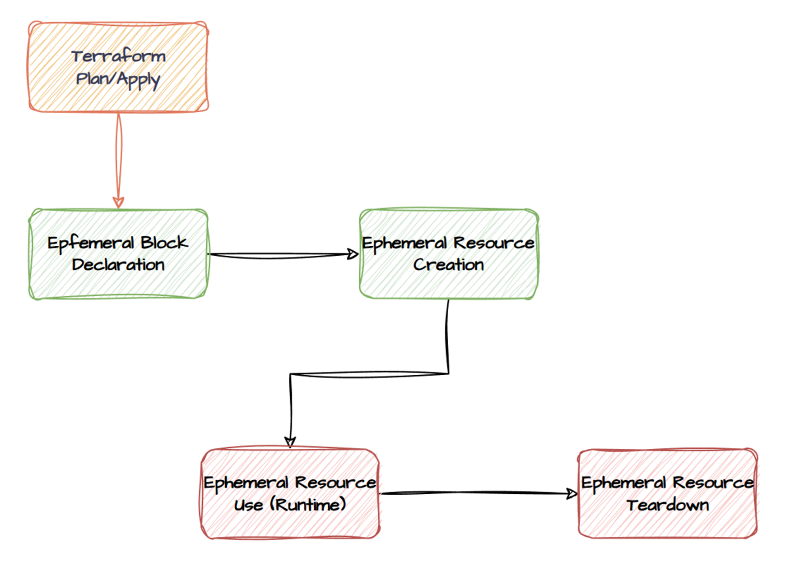
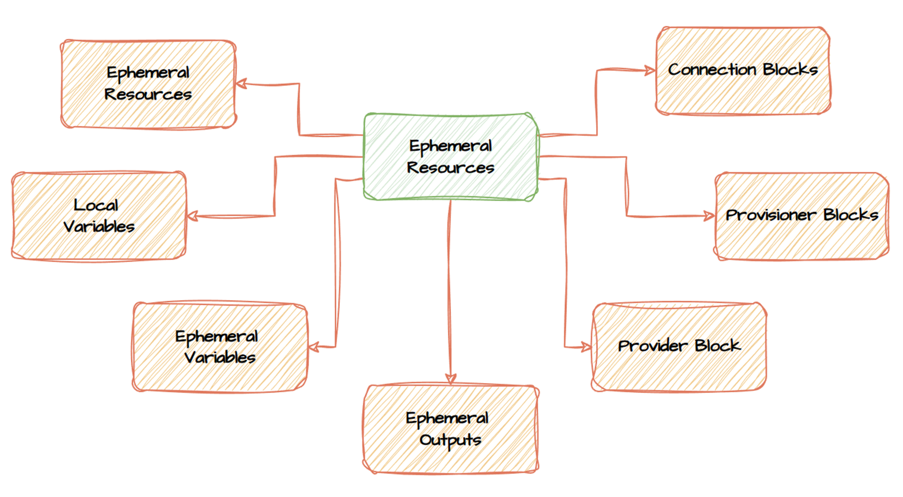
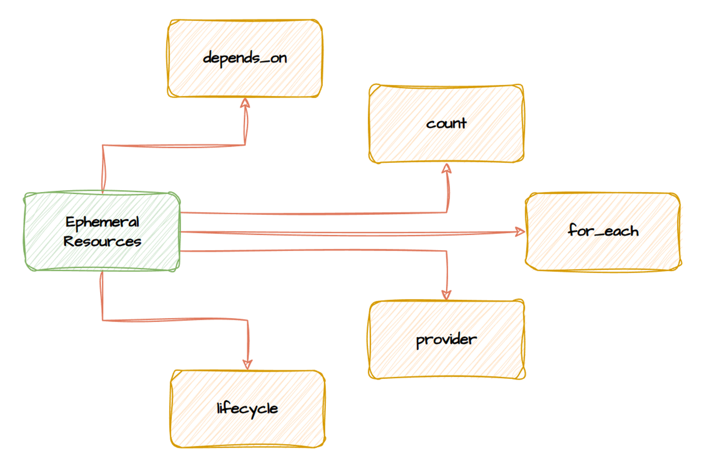

# terraform-ephemeral-resources
Materials for "Terraform Ephemeral Resources: new vision to old security issues" presentation


Simple code example:
```bash
# create demo
terraform init
terraform plan -var db_password="G76ef9DXhk9Hz2VJ" -var api_key="G76ef9DXhk9Hz2VJ" -out "terraform.tfplan"
terraform apply -var api_key="G76ef9DXhk9Hz2VJ" "terraform.tfplan"

# destroy demo
terraform plan -var db_password="G76ef9DXhk9Hz2VJ" -var api_key="G76ef9DXhk9Hz2VJ" -out "terraform.tfplan" -destroy
terraform apply -var api_key="G76ef9DXhk9Hz2VJ" "terraform.tfplan"
```
### Ephemeral Resources: flow


### Ephemeral Resources: references


### Ephemeral Resources: meta-arguments



<!-- BEGIN_TF_DOCS -->
## Requirements

| Name | Version |
|------|---------|
| terraform | >= 1.10 |
| aws | 5.82.0 |
| gitlab | 17.6.1 |

## Providers

| Name | Version |
|------|---------|
| local | 2.5.2 |

## Modules

| Name | Source | Version |
|------|--------|---------|
| common\_resources | ./modules/common-resources | n/a |
| ephemeral\_resources | ./modules/ephemeral-resources | n/a |
| gitlab-group | ./modules/gitlab-group | n/a |

## Resources

| Name | Type |
|------|------|
| [local_file.common_password](https://registry.terraform.io/providers/hashicorp/local/latest/docs/resources/file) | resource |

## Inputs

| Name | Description | Type | Default | Required |
|------|-------------|------|---------|:--------:|
| api\_key | an api key not stored in state | `string` | n/a | yes |
| db\_password | Common password for the project | `string` | n/a | yes |

## Outputs

| Name | Description |
|------|-------------|
| common\_password | Common password for the project |
<!-- END_TF_DOCS -->